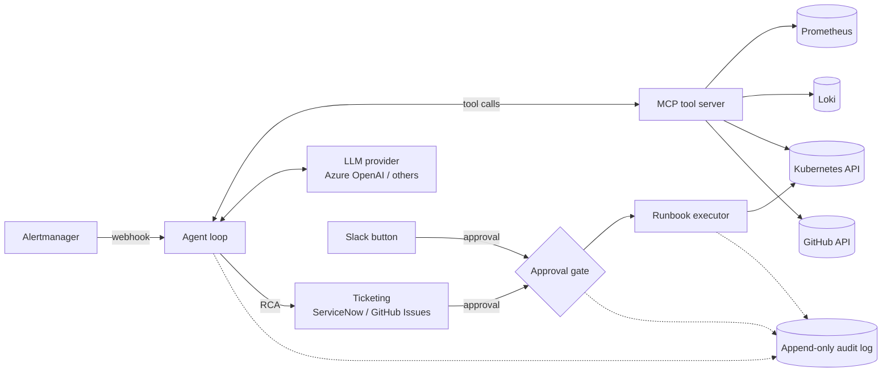

# incident-copilot

**An autonomous incident responder for Kubernetes platforms.** incident-copilot receives an alert, investigates it with real observability and delivery tools, writes a structured root-cause analysis into your ticketing system, and proposes a remediation that only runs once a human has approved it.

It is written in Go, calls LLM APIs directly with tool calling (no agent framework), exposes its tools over the [Model Context Protocol](https://modelcontextprotocol.io), and ships with an evaluation harness that measures how often the agent gets the diagnosis right.

> **Status:** early development. The design below is the target; see [Roadmap](#roadmap) for what is implemented.

---

## Why

When an alert fires at 3 a.m., the on-call engineer's first 20 minutes are spent on the same questions: *What is broken? Since when? What changed?* Answering them means jumping between dashboards, log queries, `kubectl`, and the deploy history.

incident-copilot does that first pass automatically. It correlates **metrics, logs, Kubernetes events, and source-code changes** into one line of reasoning and hands the engineer a ticket with evidence, a suspected cause, a confidence level, and a ready-to-approve fix.

It is built for environments where an AI touching production must be **controlled and auditable**:

- Remediations are limited to an allowlist of runbooks.
- Every runbook has an explicit autonomy level.
- Every tool call, LLM decision, and approval is written to an append-only audit log.

## How it works



1. **Trigger.** Alertmanager sends a webhook to the agent when an alert fires.
2. **Investigate.** The agent runs a tool-calling loop against the LLM and collects evidence until it can explain the alert or runs out of budget.
3. **Report.** It opens an incident with a structured RCA.
4. **Remediate.** It proposes one runbook from the allowlist. Depending on the runbook's autonomy level, the runbook is only suggested, waits for approval, or runs on its own.
5. **Record.** Every step is written to the audit log.

### Investigation tools

The tools are served by an MCP server, so any MCP-capable agent or client can use them, not only incident-copilot.

| Tool | Source | Answers |
|---|---|---|
| `query_metrics` | Prometheus (PromQL) | What do error rate, latency, memory, and restarts look like? |
| `search_logs` | Loki (LogQL) | What is the service saying? |
| `get_k8s_events` | Kubernetes API | Were there OOMKills, failed probes, or scheduling issues? |
| `describe_pod` | Kubernetes API | What are the pod's status, resources, and container state? |
| `recent_deployments` | Kubernetes / GitHub API | What was rolled out, and when? |
| `get_commit_diff` | GitHub API | What exactly changed in the code or config? |

### Root-cause analysis

Every incident ticket follows the same structure:

| Field | Content |
|---|---|
| **Summary** | One or two sentences on what is happening and who is affected |
| **Evidence** | The queries run and what they returned, with links |
| **Suspected cause** | The most likely root cause, tied to the evidence |
| **Confidence** | `low` / `medium` / `high`, with the reason |
| **Proposed action** | A runbook from the allowlist, with parameters |

Ticketing is behind an adapter interface. **ServiceNow** is the primary adapter and **GitHub Issues** is the fallback.

## Trust model

Remediation is where an AI agent can do real damage, so it is the most constrained part of the system.

**Allowlisted runbooks.** The agent cannot run arbitrary commands. It can only choose from a fixed set of runbooks, for example:

- `rollback_deployment`
- `restart_pod`
- `scale_up`

**Autonomy levels.** Each runbook is tagged with the most the agent may do with it:

| Level | Name | Behaviour |
|---|---|---|
| **L0** | Observe | Investigate and report only. No action is proposed. |
| **L1** | Suggest | Propose the runbook in the ticket. A human carries it out. |
| **L2** | Approve | Execute after explicit approval, given by a ticket state change or a Slack button. |
| **L3** | Autonomous | Execute immediately and report afterwards. |

The levels are configured per runbook and can be tightened per environment, for example L3 in staging and L2 in production.

**Audit log.** Every alert received, tool call with its arguments and result, LLM request and response, proposed action, approval, and execution result is appended to an append-only log. Any incident can be reconstructed from it after the fact.

The reasoning behind this model is recorded in [`docs/adr/0001-autonomy-and-trust-model.md`](docs/adr/0001-autonomy-and-trust-model.md).

## Evaluation harness

A demo that works once proves little. The harness measures how reliable the agent is.

For each fault scenario it:

1. injects the fault into the demo service,
2. waits for the alert and lets the agent run to completion,
3. scores the result against the known ground truth.

It reports, per scenario and overall:

- **Diagnosis accuracy:** did the agent name the correct root cause?
- **Remediation accuracy:** did it pick the correct runbook?
- **Time to diagnosis:** from the alert firing to the RCA being written.
- **Token cost per incident.**

This makes prompt, model, and tool changes measurable rather than a matter of impression.

## Demo environment

A local [kind](https://kind.sigs.k8s.io) cluster runs a small Go service alongside Prometheus, Loki, and Alertmanager. The service has injectable faults that cover the common categories of real incidents:

| Fault | Symptom | Expected runbook |
|---|---|---|
| Memory leak | Rising memory, OOMKills | `restart_pod` / `scale_up` |
| Bad config deploy | Error spike right after a rollout | `rollback_deployment` |
| Dependency timeout | Latency and 5xx on downstream calls | none (escalate) |
| Crash loop | `CrashLoopBackOff`, restart count rising | `rollback_deployment` |

## Getting started

### Prerequisites

- Go 1.25+
- Docker (4 CPUs and 8 GB of memory allocated), [kind](https://kind.sigs.k8s.io), `kubectl`, and [Helm](https://helm.sh) (on macOS: `brew install go kind kubectl helm`)
- An LLM provider API key (Azure OpenAI by default)
- Optional: a ServiceNow instance (a free Personal Developer Instance is enough) or a GitHub token for the Issues adapter

### Run it

```sh
make tools        # check that the prerequisites are installed
make cluster      # create the kind cluster and install Prometheus, Alertmanager, Loki, Alloy
make deploy       # build the demo-svc image and deploy orders, inventory, and loadgen
make port-forward # Prometheus :9090, Alertmanager :9093, Loki API :3100, Grafana :3000
                  # (Grafana is on by default: make cluster GRAFANA=0 or make observability GRAFANA=0 to disable it. Loki has no UI of its own.)
make down         # tear everything down
```

Planned, not implemented yet:

```sh
make fault F=memory-leak   # inject a fault and watch the agent respond
make eval                  # run the evaluation harness across all fault scenarios
```

### Configuration

Configuration is read from environment variables (a `.env` file is supported for local use):

| Variable | Description |
|---|---|
| `LLM_PROVIDER` | `azure-openai` (default), `openai`, `anthropic` |
| `AZURE_OPENAI_ENDPOINT` / `AZURE_OPENAI_API_KEY` / `AZURE_OPENAI_DEPLOYMENT` | Azure OpenAI settings |
| `PROMETHEUS_URL` / `LOKI_URL` | Observability backends |
| `GITHUB_TOKEN` / `GITHUB_REPO` | Deployment history, commit diffs, and the Issues adapter |
| `TICKETING` | `servicenow` (default) or `github` |
| `SERVICENOW_INSTANCE` / `SERVICENOW_USER` / `SERVICENOW_PASSWORD` | ServiceNow adapter |
| `SLACK_BOT_TOKEN` | Optional, for approval buttons |
| `AUDIT_LOG_PATH` | Where the append-only audit log is written |

## Design choices

- **Go, no agent framework.** The orchestration loop, tool dispatch, retries, and budgets are plain Go code that can be read and tested.
- **Tools over MCP.** The investigation tools are decoupled from the agent and can be plugged into other MCP-capable agents and platforms.
- **Pluggable LLM provider.** A small provider interface. Azure OpenAI is the default, and other providers are drop-in.
- **Adapters for ticketing and approval.** ServiceNow, GitHub Issues, and Slack sit behind interfaces, so adding Jira or PagerDuty does not touch the agent.
- **Safety before autonomy.** Allowlists, autonomy levels, and the audit log are core parts of the system, not add-ons.

## Roadmap

The detailed task breakdown, with a goal, requirements, and validation criteria for each task, is in [`docs/roadmap.md`](docs/roadmap.md). The demo environment is designed in [`docs/design/demo-environment.md`](docs/design/demo-environment.md).

- [ ] kind cluster, demo service with fault injection, and the observability stack, wired up with a Makefile
- [ ] Agent loop, MCP tool server, and RCA generation for one fault end to end
- [ ] ServiceNow integration and GitHub Issues fallback
- [ ] Runbook allowlist, autonomy levels, approval gate, and audit log
- [ ] Evaluation harness across all fault scenarios
- [ ] ADR on the autonomy and trust model
- [ ] Bicep/Terraform module to deploy the demo onto AKS

## License

[MIT](LICENSE)
