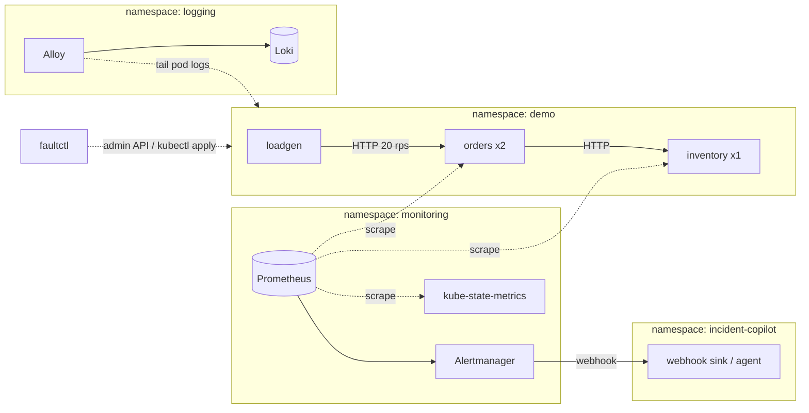

# Design: demo environment

Status: proposed · Owner: @itsankoff · Last updated: 2026-09-21

This document designs the local environment that incident-copilot is developed, demoed, and evaluated against: a kind cluster, an observability stack, and a small Go service with faults that can be injected on demand. The tasks that build it are milestone M1 in [`docs/roadmap.md`](../roadmap.md).

## Goals

1. **Realistic evidence.** Each fault leaves the same trail a real incident would: metrics, logs, Kubernetes events, and deploy history. The agent has to correlate these to reach the diagnosis.
2. **Hidden injection.** Nothing the agent can see says "fault injected". If the agent could read the answer off a log line or a label, the eval harness would measure nothing.
3. **Repeatable.** `inject → alert → clear → resolved` is deterministic, so the eval harness can run every scenario back to back without rebuilding the cluster.
4. **Fast.** An alert fires within about 3 minutes of injection. A full eval pass over four faults takes under 30 minutes.
5. **Small.** The whole stack runs on a laptop with Docker at 4 CPUs and 8 GB RAM.

Non-goals: production-grade observability (no HA, no long retention), multi-cluster setups, service mesh, or tracing. Tracing can come later if a fault needs it.

## Topology



### Cluster

- **kind** with one control-plane node and one worker node. The config lives in `deploy/kind/cluster.yaml`, and the node image is pinned there.
- Cluster name `incident-copilot`. The kubeconfig context is `kind-incident-copilot`, and every Makefile target passes `--context` explicitly so it can never touch another cluster.
- A local image registry is not needed. Images are built with `docker build` and loaded with `kind load docker-image`.
- Tool and chart versions are pinned in `deploy/versions.env` and sourced by the Makefile.

### Namespaces

| Namespace | Contents |
|---|---|
| `demo` | `orders`, `inventory`, `loadgen` |
| `monitoring` | kube-prometheus-stack: Prometheus, Alertmanager, kube-state-metrics, node-exporter, Prometheus Operator. Grafana is off by default and enabled with `GRAFANA=1`. |
| `logging` | Loki (single binary, filesystem storage) and Grafana Alloy (one replica that tails pod logs through the Kubernetes API, so it needs no hostPath mounts and ships each line once) |
| `incident-copilot` | The agent. Until the agent exists, a webhook sink that records Alertmanager payloads. |

Everything in `monitoring` and `logging` is installed with Helm from values files under `deploy/observability/`. kube-prometheus-stack scrape jobs for etcd, the scheduler, the controller manager, and kube-proxy are disabled because they are unreachable in kind and would fire noise alerts. `NodeClockNotSynchronising` is disabled too, because Docker Desktop's VM does not report NTP sync state. The upstream `kubernetesApps` rules are off, so the workload alerts that fire are exactly the ones in `alerts.yaml`.

The observability settings are tuned for speed: a 15 s scrape interval, 15 s rule evaluation, Alertmanager `group_wait: 10s`, `group_interval: 30s`, and `repeat_interval: 1h`.

## Demo service: `demo-svc`

A single Go binary in `cmd/demo-svc` runs one of three roles, chosen by `--role`. One image serves all three, which keeps the build simple and means no fault needs a separate image.

| Role | Replicas | Behaviour |
|---|---|---|
| `orders` | 2 | Public API. `GET /orders/{id}` and `POST /orders`. Each request calls `inventory` with a 1 s client timeout. |
| `inventory` | 1 | Downstream dependency. `GET /stock/{sku}`, which returns in about 5-20 ms. |
| `loadgen` | 1 | Sends a constant mix of requests to `orders` (default 20 rps, 80% reads). Exposes its own client-side metrics. |

The service uses only the standard library plus `github.com/prometheus/client_golang`, the de facto Prometheus client, to avoid reimplementing the exposition format and histograms.

### Ports

| Port | Purpose | Exposed through a Service? |
|---|---|---|
| 8080 | API (`/orders`, `/stock`) and `/healthz`, `/readyz` | Yes |
| 9090 | `/metrics` | Yes (scraped through a ServiceMonitor) |
| 9091 | Admin API for runtime faults | No. Reached only through `kubectl port-forward` by `faultctl`. |

### Telemetry contract

Everything the agent needs for a diagnosis has to be here. Everything the harness needs to inject faults stays out of it.

**Metrics:**

| Metric | Type | Labels |
|---|---|---|
| `http_requests_total` | counter | `service`, `route`, `code` |
| `http_request_duration_seconds` | histogram | `service`, `route` |
| `dependency_requests_total` | counter | `service`, `dependency`, `outcome` (`ok`, `error`, `timeout`) |
| `dependency_request_duration_seconds` | histogram | `service`, `dependency` |
| `build_info` | gauge (always 1) | `service`, `version`, `commit` |
| Go runtime and process metrics | default collectors | |

Container memory, restarts, OOMKills, and waiting reasons come from cAdvisor and kube-state-metrics.

**Logs:** JSON through `log/slog` to stdout. Every line carries `service`, `version`, and `commit`. Request logs add `request_id`, `route`, `status`, and `duration_ms`. Errors include the underlying cause, for example `inventory call failed: context deadline exceeded`. Alloy ships them to Loki with the labels `namespace`, `app`, `pod`, and `container`.

**Deploy provenance:** every Deployment carries the annotations `kubernetes.io/change-cause`, `app.kubernetes.io/version`, and `incident-copilot.dev/commit` (the Git SHA of the config or code that was rolled out). `recent_deployments` reads the ReplicaSet history and these annotations.

### Resources

| Workload | Requests | Limits |
|---|---|---|
| `orders` | 50m CPU, 32Mi | 250m CPU, **128Mi** |
| `inventory` | 50m CPU, 32Mi | 250m CPU, 128Mi |
| `loadgen` | 20m CPU, 16Mi | 100m CPU, 64Mi |

The 128Mi memory limit on `orders` sets how long the memory-leak scenario takes to reach an OOMKill.

Probes: `readinessProbe` on `/readyz` and `livenessProbe` on `/healthz`. `orders` reports not-ready if its configuration fails to load. The rollout strategy is `RollingUpdate` with `maxUnavailable: 0` and `maxSurge: 1`, so a rollout whose pods never become ready leaves the old pods serving, as it would in a real cluster. Readiness checks only the service's own configuration, never `inventory`, so a broken dependency does not stall rollouts or hide errors.

## Alerting

The rules live in a `PrometheusRule` at `deploy/observability/alerts.yaml`. They fire on symptoms, never on causes. Deciding the cause is the agent's job.

| Alert | Expression (sketch) | `for` | Severity |
|---|---|---|---|
| `HighErrorRate` | 5xx share of `http_requests_total` by service > 5% | 1m | critical |
| `HighLatency` | p95 of `http_request_duration_seconds` by service > 800ms | 2m | warning |
| `ContainerMemoryNearLimit` | `container_memory_working_set_bytes` / limit > 0.85 | 30s | warning |
| `ContainerOOMKilled` | increase in restarts where the last terminated reason is `OOMKilled` | 0m | critical |
| `PodCrashLooping` | `kube_pod_container_status_waiting_reason{reason="CrashLoopBackOff"}` == 1 | 1m | critical |

Every alert carries the labels `namespace`, `service` (or `pod` and `container`), and `severity`, plus a `summary` annotation. Alerts carry no hints about the cause.

Alertmanager has a single receiver, a webhook to `http://incident-copilot.incident-copilot.svc:8080/webhook/alertmanager`, with `send_resolved: true`. Until the agent exists, a small **webhook sink** (`cmd/webhook-sink`) runs at that address and writes each payload to stdout and to `/data/alerts.jsonl`. The M1 smoke test uses it to check that alerts fire.

## Fault injection

### Principles

- Faults come in two kinds. **Deploy faults** are a real rollout of a bad change. **Runtime faults** switch on behaviour through the admin API.
- The admin API is not logged. Its port is not in any Service, and its state is stored under a neutral path (`/var/run/demo/state.json`).
- Fault names never appear in anything the agent can read, including env var names, ConfigMap keys, annotations, commit messages, and log lines. Deploy faults use plausible-looking changes.
- A leakage check is part of the smoke test. After each injection it greps everything the MCP tools can return (logs, events, pod specs, and deploy annotations) for `fault`, `inject`, and scenario names, and fails if any match.

### Runtime fault state and restarts

Runtime fault state is written to an `emptyDir` volume. An `emptyDir` **survives container restarts but not pod deletion**, which gives the right behaviour for each case:

- An OOMKill restarts the container, the state survives, and the leak starts again. The pod stays sick, just as a real leaking pod does.
- `restart_pod` deletes the pod, and the new pod starts clean. The runbook "fixes" the incident, as a real restart buys time.

### `faultctl`

`cmd/faultctl` is the only way faults get in or out. `make fault` and the eval harness both call it.

```sh
faultctl list                       # scenarios and their ground truth
faultctl inject <scenario> [--git=github|none]
faultctl status                     # what is currently armed, rollout state
faultctl clear                      # restore baseline and wait until healthy
```

`clear` is the reset between eval runs. It clears the admin state on every pod, rolls each Deployment back to the baseline manifest, deletes pods that hold runtime state, and blocks until every pod is Ready and no alerts are firing (or a timeout passes). It is safe to run more than once.

### Scenario spec

Each scenario is a file under `eval/scenarios/`, which gives the fault and its ground truth in one place, as CLAUDE.md requires:

```yaml
name: memory-leak
kind: runtime                 # runtime | deploy
inject:
  target: orders
  admin: { behaviour: retain, bytes_per_second: 1048576 }
expect:
  alerts: [ContainerMemoryNearLimit, ContainerOOMKilled]
  alert_within: 4m
  cause: memory_leak          # ground-truth category used for scoring
  cause_facts:                # facts a correct RCA must mention
    - orders memory grows steadily until OOMKilled
    - no deploy correlates with the onset
  runbook: [restart_pod, scale_up]   # any of these counts as correct
```

### The four scenarios

| Scenario | Kind | Mechanism | Evidence trail | Expected runbook |
|---|---|---|---|---|
| **memory-leak** | runtime | The `orders` admin API turns on a response cache with no eviction that keeps about 1 MiB/s. | `container_memory_working_set_bytes` climbs linearly to the limit, then `ContainerOOMKilled`, restart count rises, and the sawtooth repeats. No recent deploy. | `restart_pod` / `scale_up` |
| **bad-config** | deploy | A rollout of `orders` with a changed ConfigMap: `INVENTORY_URL` points to a host that does not exist (`inventory-v2`). | A new ReplicaSet with a fresh `change-cause`, then 5xx on `orders` rising straight after the rollout. Logs show `dial tcp: lookup inventory-v2 ... no such host`. `inventory` stays healthy. The commit diff shows the one-line change. | `rollback_deployment` |
| **dependency-timeout** | runtime | The `inventory` admin API adds 1.5-3 s of latency. | `orders` p95 latency and 5xx rise, and `dependency_requests_total{outcome="timeout"}` rises. `orders` logs say `context deadline exceeded` and `inventory` has no errors, just slow. There is no deploy and no resource pressure. | none (escalate) |
| **crash-loop** | deploy | A rollout of `orders` with a malformed config value (`ORDER_TTL=15x`), which makes startup exit with status 1. | The new pod shows `CrashLoopBackOff`, restarts climb, and the old pods keep serving. Logs show `fatal: load config: ORDER_TTL: time: unknown unit "x"`. The rollout is stuck. The commit diff shows the change. | `rollback_deployment` |

The scenarios are built to be told apart on evidence, not on the alert name. bad-config and dependency-timeout both raise 5xx on `orders`, and only deploy correlation and the log cause separate them.

### Deploy provenance and commit diffs

`get_commit_diff` needs a real commit on GitHub. Deploy faults therefore support two modes:

- `--git=none` (default, offline). The rollout is annotated with a synthetic SHA and `get_commit_diff` returns not-found. The agent has to diagnose from the rollout timing and logs alone.
- `--git=github`. `faultctl` commits the config change to `GITHUB_REPO` on the branch `demo-env` (an ordinary message such as `orders: point to inventory-v2 service`), then annotates the rollout with that SHA. `clear` reverts the change with a second commit.

The configuration that deploy faults change lives in a **separate repository** (the demo config repo that `GITHUB_REPO` points to), not in this one. Otherwise the fault overlays in this repo would show up in diffs and give the answer away.

## Repository layout

```
cmd/demo-svc/            orders | inventory | loadgen roles
cmd/faultctl/            fault injection CLI
cmd/webhook-sink/        records Alertmanager webhooks (M1 stand-in for the agent)
internal/demo/           service handlers, config, admin API, telemetry
deploy/versions.env      pinned tool, chart, and node-image versions
deploy/kind/             cluster.yaml
deploy/observability/    Helm values, alerts.yaml, ServiceMonitors
deploy/demo/             Kustomize base for orders, inventory, loadgen, webhook-sink
eval/scenarios/          one YAML per fault (injection and ground truth)
test/e2e/                smoke tests, build tag `e2e`
Makefile
```

## Makefile targets (M1)

| Target | Does |
|---|---|
| `make tools` | Checks that `docker`, `kind`, `kubectl`, `helm`, and `go` are installed at the pinned versions |
| `make cluster` | Creates the kind cluster and installs the observability stack (`make observability`). Idempotent. |
| `make build` / `test` / `vet` | Go build, unit tests, vet |
| `make image` | Builds the `demo-svc` image, tagged with the Git SHA, and loads it into kind |
| `make deploy` | Builds the image, applies `deploy/demo` through a generated overlay that sets the tag, and waits for rollout |
| `make status` / `port-forward` | Pod overview. Prometheus :9090, Alertmanager :9093, and Loki :3100 on localhost. |
| `make fault F=<scenario>` | `faultctl inject` |
| `make clear` | `faultctl clear` |
| `make smoke` | `go test -tags e2e ./test/e2e/...` |
| `make down` | Deletes the cluster |

## Open questions

1. Does the demo config repo live under the same GitHub account (`itsankoff/incident-copilot-demo-config`)? This design assumes yes.
2. Should Alloy be replaced with Promtail? Alloy is assumed because Promtail is deprecated upstream.
3. Should there be a "decoy" scenario, with a harmless deploy just before an unrelated runtime fault, to test that the agent does not confuse correlation with cause? It is proposed as a stretch task in M5.
